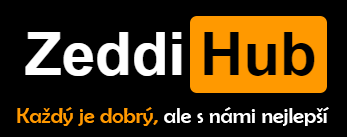

<p align="center">
  
</p>

<p align="center">
  <strong>Sada konzolových TUI nástrojů pro správu herních serverů a konfigurací</strong>
</p>

<p align="center">
  
  
  
  
  
</p>

---

## O projektu

ZeddiHub Tools je sada modulárních konzolových nástrojů určených pro správce herních serverů a hráče. Celá aplikace běží v terminálu s barevným TUI rozhraním, navigací pomocí kláves a průvodcem při prvním spuštění. Nepotřebuje žádné externí závislosti.

## Moduly

<table>
  <tr>
    <td align="center" width="120"><h3>RUST</h3></td>
    <td><strong>Rust Editor</strong> — Opravy, kompilace a analýza Oxide/uMod pluginů, editor databází (SQL/SQLite), RCON klient, plugin dependency checker</td>
  </tr>
  <tr>
    <td align="center"><h3>CSGO</h3></td>
    <td><strong>CS:GO Tools</strong> — Crosshair generátor s náhledem, viewmodel generátor s live 2D oknem, autoexec/practice config, buy bindy, server.cfg generátor, editor .cfg souborů</td>
  </tr>
  <tr>
    <td align="center"><h3>CS2</h3></td>
    <td><strong>CS2 Tools</strong> — Crosshair generátor, viewmodel s ASCII náhledem, autoexec s vlastními příkazy a důležitými cvary, server.cfg, RCON klient</td>
  </tr>
  <tr>
    <td align="center"><h3>LANG</h3></td>
    <td><strong>Translator</strong> — Hromadný překlad souborů (JSON/TXT/LANG), prefix manager, statistiky překladu, batch export (TXT/JSON/CSV), Google Translate API</td>
  </tr>
  <tr>
    <td align="center"><h3>STAT</h3></td>
    <td><strong>Server Status</strong> — Real-time monitoring herních serverů přes A2S_INFO protokol, live dashboard, quick query, auto-refresh, podpora CS2/CS:GO/Rust/TF2/Garry's Mod</td>
  </tr>
</table>

## Instalace

```bash
git clone https://github.com/ZeddiS/zeddihub-tools.git
cd zeddihub-tools
```

### Požadavky

- **Windows 10/11**
- **Python 3.10+**
- Žádné externí závislosti

## Spuštění

Dvojklik na **`ZeddiHub Tools Launcher.bat`** nebo:

```bash
python launcher.py
```

Při prvním spuštění každého modulu se automaticky zobrazí průvodce nastavením.

## Ovládání

| Klávesa | Akce |
|---------|------|
| `W` / `S` | Pohyb v menu nahoru / dolů |
| `D` / `Enter` | Potvrdit výběr |
| `A` / `Esc` | Zpět / Zavřít |

## Struktura projektu

```
zeddihub-tools/
├── launcher.py                  # Hlavní launcher s výběrem modulů
├── ZeddiHub Tools Launcher.bat  # Windows spouštěč
├── assets/                      # Loga a grafika
│   ├── banner.png
│   ├── logo.png
│   └── icon.png
├── zeddihub_rust_editor/        # Rust Editor modul
├── zeddihub_csgo_tools/         # CS:GO Tools modul
├── zeddihub_cs2_tools/          # CS2 Tools modul
├── zeddihub_translator/         # Translator modul
└── zeddihub_server_status/      # Server Status modul
```

Každý modul má svou vlastní strukturu: `core.py` (základ + barvy), `langs.py` (CZ/EN překlady), `wizard.py` (průvodce prvním spuštěním), `menus.py` (menu systém), `main.py` (vstupní bod).

## Changelog

Kompletní seznam změn najdete v [Releases](https://github.com/ZeddiS/zeddihub-tools/releases).

## Licence

Tento projekt je soukromý. Všechna práva vyhrazena.

---

<p align="center">
  
</p>

<p align="center">
  <strong>ZeddiS</strong><br>
  <a href="https://zeddihub.eu">zeddihub.eu</a> ·
  <a href="https://zeddis.xyz">zeddis.xyz</a> ·
  <a href="https://dsc.gg/zeddihub">Discord</a>
</p>
